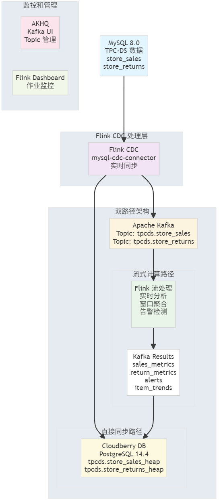

# TPC-DS 流批一体处理 Demo

**作者：Vance Chen**

## 项目概述

本项目构建了一个完整的流批一体数据处理演示环境，基于 TPC-DS 标准数据模型，展示从 MySQL 业务数据库到 Kafka 消息队列，再到 Flink 流处理的完整数据链路。

## 架构设计


```
# 双路径架构：
路径1: MySQL → Flink CDC → Kafka → Flink 流式计算 → Cloudberry
路径2: MySQL → Flink CDC → Cloudberry（直接同步）
```

### 核心组件

1. **MySQL 8.0** - 业务交易数据库
   - 基于 TPC-DS 标准的 `store_sales` 和 `store_returns` 表
   - 启用 binlog 支持 CDC
   - 包含自增主键和时间戳字段

2. **Apache Kafka** - 事件总线
   - 高可用消息队列
   - 自动创建 Topic
   - JMX 监控支持

3. **Flink CDC** - 变更数据捕获
   - 基于 flink-sql-connector-mysql-cdc
   - 支持增量快照和全量同步
   - 直接转换为 PostgreSQL 兼容语句

4. **Apache Flink** - 流处理引擎
   - JobManager + TaskManager 架构
   - 支持流批一体处理
   - Web UI 监控

5. **AKHQ** - Kafka 管理界面
   - Topic 可视化管理
   - 消息实时查看
   - Connect 状态监控

6. **Cloudberry 数据仓库** - 目标存储
   - 基于 PostgreSQL 14.4 内核
   - 兼容 Greenplum 生态
   - 支持实时和批量数据写入

## 数据模型

### store_sales 表（商店销售）
- 基于 TPC-DS 标准
- 包含销售维度键、价格、数量、利润等字段
- 支持实时数据生成

### store_returns 表（商店退货）
- 退货业务数据
- 关联原始销售票据
- 支持退货金额、税费计算

## 快速开始

### 1. 环境要求
- Docker & Docker Compose
- Python 3.8+ (可选，用于数据生成)
- 8GB+ 内存推荐

### 2. 启动环境
```bash
# 一键启动所有服务
./start-demo.sh
```

### 3. 验证环境
- **AKHQ UI**: http://localhost:8080
- **Flink Dashboard**: http://localhost:8081
- **Kafka Connect API**: http://localhost:8083

### 4. 数据生成
```bash
# 安装 Python 依赖
pip install -r requirements.txt

# 启动数据生成器
python3 scripts/data-generator.py
```

## 使用场景

### 1. Flink CDC 数据同步验证
观察 MySQL 数据变更如何通过 Flink CDC 同步：
- **路径1**: MySQL → Flink CDC → Kafka Topics
  - `tpcds.store_sales`
  - `tpcds.store_returns`
- **路径2**: MySQL → Flink CDC → Cloudberry（直接写入）

### 2. 流处理开发测试
- 基于真实业务数据模型
- 支持复杂的流式计算场景
- 易于扩展到批处理

### 3. 性能基准测试
- TPC-DS 标准数据模型
- 可配置数据生成速率
- 支持大规模数据测试

## 核心特性

✅ **生产级架构** - 基于成熟开源组件  
✅ **标准数据模型** - TPC-DS 业界标准  
✅ **实时同步** - 毫秒级 CDC 延迟  
✅ **可视化监控** - 完整的 UI 界面  
✅ **容器化部署** - 一键启动环境  
✅ **可扩展设计** - 支持 Cloudberry 直接集成  

## 技术亮点

1. **数据类型映射优化**
   - PostgreSQL → MySQL 类型转换
   - 保持 TPC-DS 语义一致性

2. **Flink CDC 性能优化**
   - 增量快照 + 实时 binlog 读取
   - 并行处理和 Checkpoint 机制
   - 支持背压和故障恢复

3. **索引策略**
   - 基于查询模式的复合索引
   - CDC 友好的主键设计

4. **监控体系**
   - Flink 作业监控和指标
   - Kafka Topic 实时监控
   - 端到端数据流可视化

5. **双路径设计**
   - 直接同步路径：适用于数据仓库 ETL
   - 流式计算路径：适用于实时分析

## 后续规划

- [x] Flink CDC 配置和 SQL 作业示例
- [ ] Cloudberry 容器化集成
- [ ] 实时 OLAP 查询示例
- [ ] 数据质量监控和告警
- [ ] 性能基准测试报告
- [ ] 增量视图物化实现

## 故障排除

### 常见问题
1. **MySQL 连接失败** - 检查容器状态和端口映射
2. **Flink CDC 作业失败** - 验证 binlog 配置和用户权限
3. **Kafka Topic 无数据** - 确认 Flink CDC 作业运行状态
4. **JAR 包缺失** - 检查 ./flink-lib/ 目录中的连接器文件

### 日志查看
```bash
# 查看 Flink JobManager 日志
docker logs flink-jobmanager

# 查看 Flink TaskManager 日志
docker logs flink-taskmanager

# 查看 MySQL 日志
docker logs mysql

# 查看所有服务状态
docker-compose ps

# 进入 Flink SQL Client
docker exec -it flink-jobmanager ./bin/sql-client.sh
```

## 贡献指南

欢迎提交 Issue 和 Pull Request！

请确保：
- 遵循现有代码风格
- 添加必要的中文注释
- 更新相关文档

---

**联系方式**: Vance Chen  
**项目地址**: 流批一体增量视图物化系统 